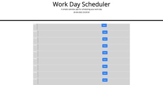

# scheduler-planner

## Description 
In this task a planning schedule has been created. This application gives the user a tool to plan their tasks. The local storage lets the user save their text so they won't forget the tasks throughout the day. Moment allows user to see the time in the title AND the Past, Present and Future is highlighted to the corresponding time of day. HTML, CSS and JS has been used to complete this application. 

### https://njenkins2727.github.io/scheduler-planner/